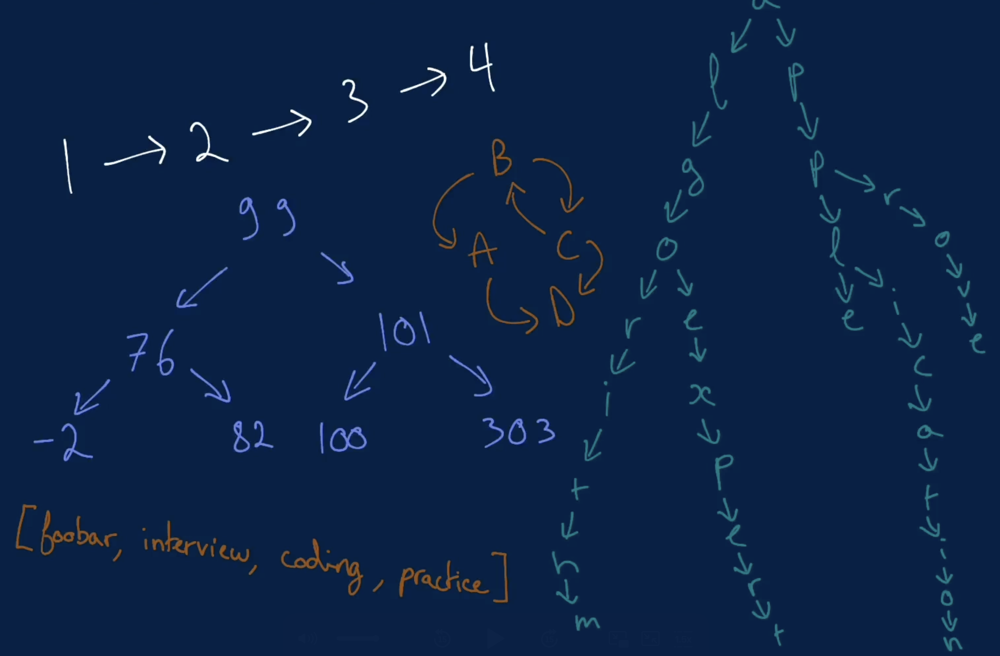

# Data Structures Crash Course

## 1. Introduction

An overview of the importance of data structures in computer science and software engineering.

## 2. What Are Data Structures

Definition and purpose of data structures, with examples of their use in solving computational problems.

## 3. Complexity Analysis

Understanding time and space complexity to evaluate the efficiency of algorithms.

## 4. Memory

How data structures utilize memory and the impact of memory allocation on performance.

## 5. Big O Notation

Explanation of Big O notation and its role in analyzing algorithm efficiency.

## 6. Logarithm

Introduction to logarithms and their significance in algorithm analysis.

## 7. Arrays

Overview of arrays, their properties, and common operations.

## 8. Linked Lists

Explanation of linked lists, types (singly, doubly, circular), and use cases.

## 9. Hash Tables

Understanding hash tables, hashing functions, and collision resolution techniques.

## 10. Stacks and Queues

Introduction to stacks and queues, their operations, and applications.

## 11. Strings

Working with strings as a data structure and common string manipulation techniques.

## 12. Graphs

Overview of graphs, types (directed, undirected, weighted), and traversal algorithms.

## 13. Trees

Introduction to trees, types (binary, binary search, AVL, etc.), and their applications.
